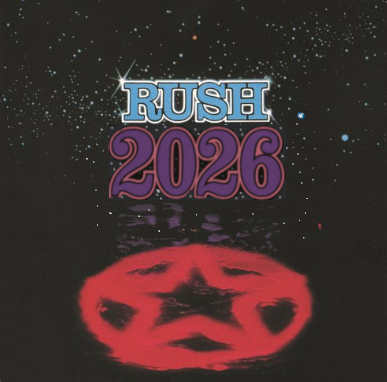

# Rush Rock Trivia



## A tribute to Geddy, Alex, and Neil

[![TypeScript][typescript-badge]][typescript-url]
[![React][react-badge]][react-url]
[![Vite][vite-badge]][vite-url]
[![Google AI][google-ai-badge]][google-ai-url]

## About

Rush Rock Trivia is an AI-powered trivia application dedicated to the
legendary Canadian progressive rock trio **Rush**. Test your knowledge about
Geddy Lee, Alex Lifeson, and Neil Peart with challenging questions covering
their extensive discography, band history, lyrics, and musical legacy.

### Features

- **📝 Rush Fan Story Modal**: Prompts the user for their Rush fan story before
   chat/LLM interaction.
- **🎫 Floating Fan Story Badge**: Always-visible badge displays the user’s Rush
   fan story and updates if the story changes.
- **💬 Start Chat & Chat Interface**: “Start Chat” button and chat UI, enabled
   only if a fan story exists.
- **🤖 LLM Contextual Chat**: All chat interactions with Gemini LLM include the
   fan story as context. LLM replies are brief, friendly, and reference the user’s
   fan experience.
- **🧠 AI-Generated Questions**: Dynamic trivia questions powered by Google's
   Gemini AI
- **🔀 Randomized Answers**: Answer options are shuffled for each question
- **🏆 Smart Scoring**: Track your performance with Rush-themed feedback
- **🎨 Rush-Inspired Design**: Dark theme with band-inspired colors and styling
- **🆕 Duplicate Prevention**: Ensures unique questions in each game session
- **⚡ Real-time Feedback**: Immediate visual feedback for correct/incorrect
   answers
- **📱 Responsive Design**: Works perfectly on desktop and mobile devices

## Quick Start

### Prerequisites

- **Node.js** (version 18 or higher)
- **Google Gemini API Key** ([Get one here][gemini-api])

### Installation

1. **Clone the repository**

   ```bash
   git clone https://github.com/m2web/rush-rock-trivia.git
   cd rush-rock-trivia
   ```

2. **Install dependencies**

   ```bash
   npm install
   ```

3. **Set up environment variables**

   For local development, create a `.env.local` file in the root directory:

   ```text
   GEMINI_API_KEY=your_gemini_api_key_here
   ```

   For Cloudflare Pages deployment:
   - Go to your Cloudflare Pages project dashboard
   - Navigate to Settings → Environment variables
   - Add `GEMINI_API_KEY` with your API key value
   - Set it for both "Production" and "Preview" environments

4. **Start the development server**

   ```bash
   npm run dev
   ```

   Navigate to `http://localhost:3000`

   **How it works:**
   - **Development**: Uses direct Gemini API calls with `VITE_API_KEY`
   - **Production**: Automatically switches to secure Cloudflare Pages Functions
   - **Smart fallback**: If Pages Function fails, falls back to direct API

5. **Production Deployment**

   Deploy to Cloudflare Pages with:

   ```bash
   npm run build
   npm run pages:deploy
   ```

## How to Play

1. **Start the Game**: Click "Begin the Test" on the welcome screen
2. **Answer Questions**: Choose from 4 multiple-choice answers for each
   question
3. **Get Feedback**: See immediate visual feedback for your answers
4. **Complete the Quiz**: Answer all 5 questions to see your final score
5. **Play Again**: Challenge yourself with new AI-generated questions

## Technology Stack

- **Frontend Framework**: React 19.2.0 with TypeScript
- **Build Tool**: Vite 6.2.0
- **Backend**: Cloudflare Pages Functions (secure API proxy)
- **AI Service**: Google Gemini 2.5 Flash via REST API
- **Styling**: Tailwind CSS (utility-first CSS framework)
- **State Management**: React Hooks (useState, useCallback)
- **Deployment**: Cloudflare Pages with edge computing

## Security Features

- **API Key Protection**: Gemini API key stored securely server-side
- **Edge Computing**: Cloudflare Pages Functions run on the edge
- **No Client Exposure**: API keys never exposed in client bundle
- **Rate Limiting**: Built-in protection via Cloudflare infrastructure
- **CORS Security**: Proper cross-origin request handling

## Project Structure

```text
rush-rock-trivia/
├── src/
│   ├── components/           # Reusable UI components
│   │   ├── StartScreen.tsx   # Welcome screen
│   │   ├── QuestionCard.tsx  # Quiz question display
│   │   ├── EndScreen.tsx     # Results screen
│   │   ├── LoadingSpinner.tsx# Loading indicator
│   │   └── IconComponents.tsx# Custom Rush-themed icons
│   ├── services/
│   │   └── geminiService.ts  # AI service integration
│   ├── App.tsx              # Main application component
│   ├── types.ts             # TypeScript type definitions
│   └── index.tsx            # Application entry point
├── images/                  # Rush-themed assets
├── package.json            # Dependencies and scripts
└── README.md               # This file
```

## AI Integration

The application uses Google's Gemini AI to generate challenging Rush trivia
questions with:

- **Structured Output**: JSON schema validation ensures consistent
  question format
- **Content Guidelines**: Prompts designed to create engaging,
  fan-appropriate questions
- **Error Handling**: Graceful fallback for API failures
- **Quality Control**: Validation to ensure exactly 3 incorrect answers
  per question

## Game Mechanics

- **5 Questions per Game**: Perfect length for a quick trivia session
- **Multiple Choice**: 4 options per question (1 correct, 3 incorrect)
- **2-Second Feedback Delay**: Allows players to see answer results
  before continuing
- **Rush-Themed Scoring Messages**:
  - Perfect Score: "A Modern Day Warrior! Perfect Score!"
  - 80%+: "Closer to the Heart! Excellent job!"
  - 50%+: "Working Man! A solid effort!"
  - <50%: "Time Stand Still... Better luck next time!"

## Available Scripts

```bash
npm run dev      # Start development server
npm run build    # Build for production
npm run preview  # Preview production build locally
```

## Contributing

Contributions are welcome! Whether you want to:

- Add new features
- Improve the UI/UX
- Fix bugs
- Enhance the AI prompts
- Add more Rush-themed elements

Please feel free to open an issue or submit a pull request.

## License

This project is open source and available under the [MIT License][license].

## About Rush

Rush was a Canadian rock band formed in Toronto in 1968, consisting of
Geddy Lee (bass, vocals, keyboards), Alex Lifeson (guitar), and Neil Peart
(drums, percussion, lyrics). Known for their complex compositions,
philosophical lyrics, and virtuosic musicianship, Rush is considered one of
the most influential progressive rock bands of all time.

Now looking forward to their 2026 world tour with the new drummer Anika Nilles,
as the *Elder Race* returns to the stage.

---

**"Growing up...opinions are provided, the future pre-decided...."** -
Rush, *Subdivisions*

Made with love for Rush fans everywhere

[typescript-badge]: https://img.shields.io/badge/TypeScript-007ACC?style=for-the-badge&logo=typescript&logoColor=white
[typescript-url]: https://www.typescriptlang.org/
[react-badge]: https://img.shields.io/badge/React-20232A?style=for-the-badge&logo=react&logoColor=61DAFB
[react-url]: https://reactjs.org/
[vite-badge]: https://img.shields.io/badge/Vite-646CFF?style=for-the-badge&logo=vite&logoColor=white
[vite-url]: https://vitejs.dev/
[google-ai-badge]: https://img.shields.io/badge/Google%20AI-4285F4?style=for-the-badge&logo=google&logoColor=white
[google-ai-url]: https://ai.google.dev/
[gemini-api]: https://ai.google.dev/
[license]: LICENSE
